<p align="center">
  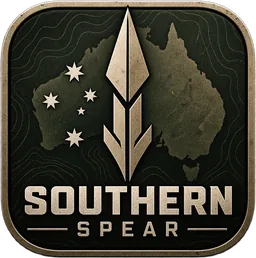
</p>

<p align="center">
  <strong>A free, original, Australian-inspired tactical multiplayer FPS.</strong><br>
  <em>One life. One objective. Every rank earned.</em>
</p>

<p align="center">
  
  
  
  
  
  <a href="https://theantipopau.github.io/southernspear-site/"></a>
</p>

<p align="center">
  
</p>

---

**Southern Spear** is a free tactical shooter built on **Unreal Engine 5.8** and the **Lyra Starter Game**,
inspired by the design philosophy of the classic *America's Army* games: slow, deliberate, team-first
infantry combat where a single life matters. Players serve in **3 ACR**, the fictional 3rd Battalion,
Australian Commonwealth Regiment, against the **Murasian Armed Forces (MAF)**, a competent conventional
force. Both teams are mechanically identical: each player sees their own side as 3 ACR and the other as
MAF.

> **Status: pre-alpha.** Phase 1, the vertical slice, is active. There is no public build yet.
> Follow along on the [website](https://theantipopau.github.io/southernspear-site/) or in the
> [session changelog](Docs/CHANGELOG.md).

## Highlights

| | |
|---|---|
| 🎯 **Two game modes** | **Objective Assault**: capture-and-hold on Dry River. **Section Assault** (ADR-031): one life per round, attack and defend, first to five rounds. |
| 🎖️ **Australian Army ranks** | Service levels 1–100 from Private to General, with rank insignia on the scoreboard. XP comes from objectives, round and match wins, and kills, capped per match so it can't be farmed (ADR-034). |
| 📋 **Service record** | A versioned, migratable profile: the server awards XP, the client keeps the record (ADR-032). |
| 🔫 **Real weapons, real numbers** | Weapon models rebuilt from the ADF Re-Cut pack, with each weapon's rate of fire, magazine, fire modes and spread taken from its source data. |
| ✋ **Hands where they belong** | Grip points solved from Arma hand poses: the left hand is placed on each weapon's handguard by IK, in first and third person. |
| 💥 **Presentation that sells the shot** | Spent cases thrown from the real ejection port, a muzzle flash that lights the scene, and tactical movement (walk, sprint, lean). |
| 🧱 **Ballistics and damage** | Bullet penetration through thin cover, and head, torso and limb hit zones. |
| 🗺️ **Generated maps** | Maps are built from a shared specification by Blender and Unreal scripts, and checked by verifiers that fail the build on drift. |

## Weapons

Each weapon is rebuilt from the ADF Re-Cut source models, with real optics, and tuned from its source
data: rate of fire, magazine size, fire modes and dispersion.

<table>
  <tr>
    <td align="center" width="50%">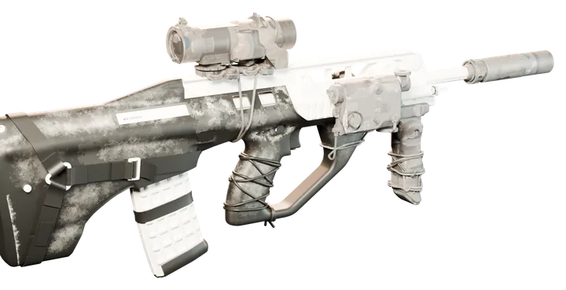<br><strong>A88</strong> · service rifle (EF88 bullpup)<br><sub>682 rpm · 30 rounds</sub></td>
    <td align="center" width="50%">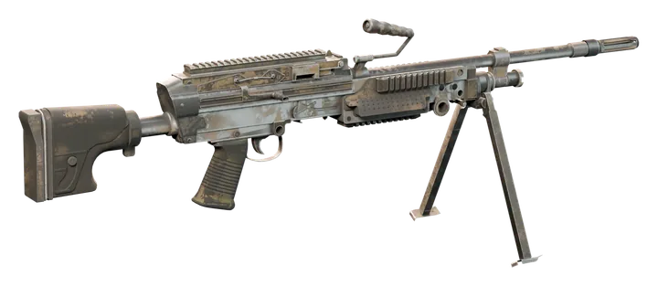<br><strong>A89</strong> · light support weapon (F89 Minimi)<br><sub>750 rpm · 200-round belt</sub></td>
  </tr>
  <tr>
    <td align="center">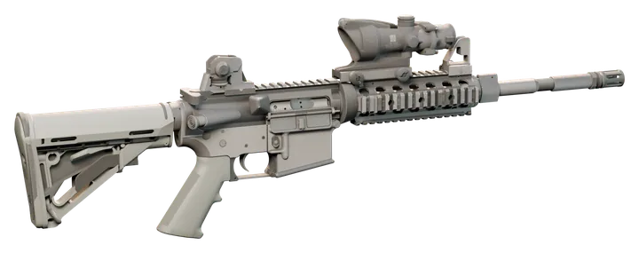<br><strong>A4</strong> · carbine (M4 pattern)<br><sub>857 rpm · 30 rounds</sub></td>
    <td align="center">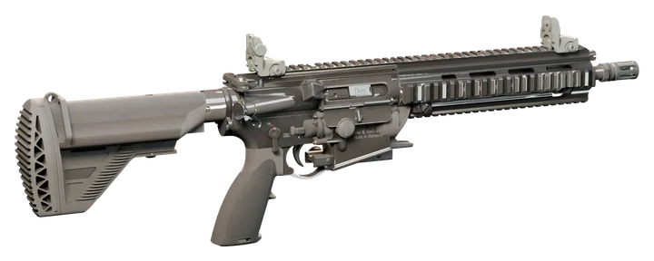<br><strong>A416</strong> · rifle (HK416 pattern)<br><sub>857 rpm · 30 rounds</sub></td>
  </tr>
  <tr>
    <td align="center" colspan="2">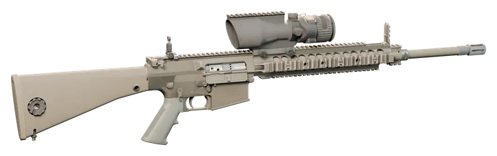<br><strong>A25</strong> · marksman rifle (7.62×51)<br><sub>semi-automatic · 20 rounds</sub></td>
  </tr>
</table>

## Ranks

Seventeen Australian Army ranks over service levels 1–100: Lance Corporal at level 5, General at 100. The
insignia below are drawn by the same engine-free code the game uses on the scoreboard
(`SSInsigniaRaster.h`); regenerate them with `python Tools/Progression/insignia_svg.py`.

<p align="center">
  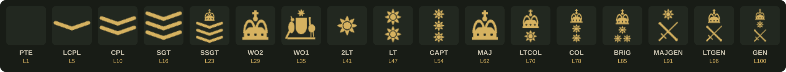
</p>

## Concept art

<p align="center">
  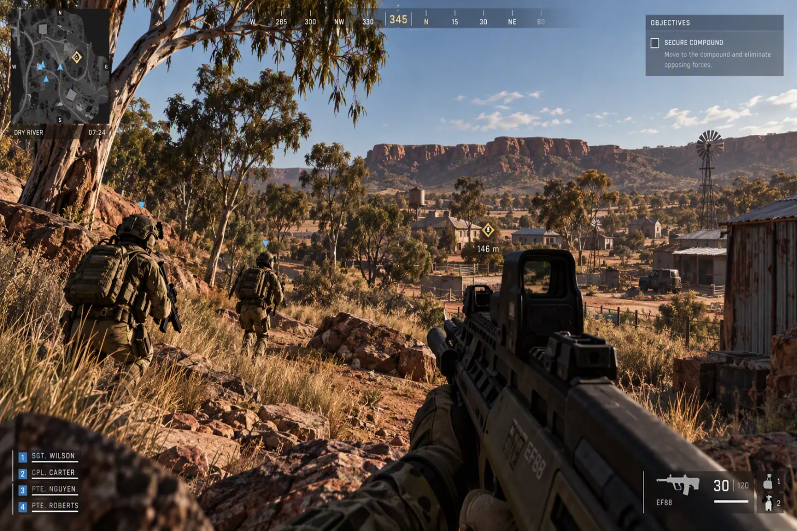
  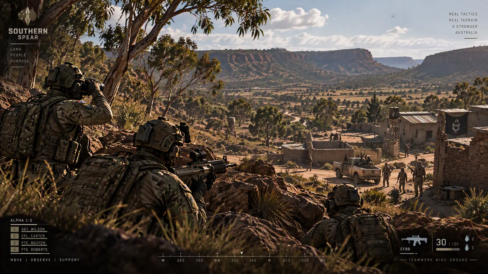
</p>
<p align="center">
  
  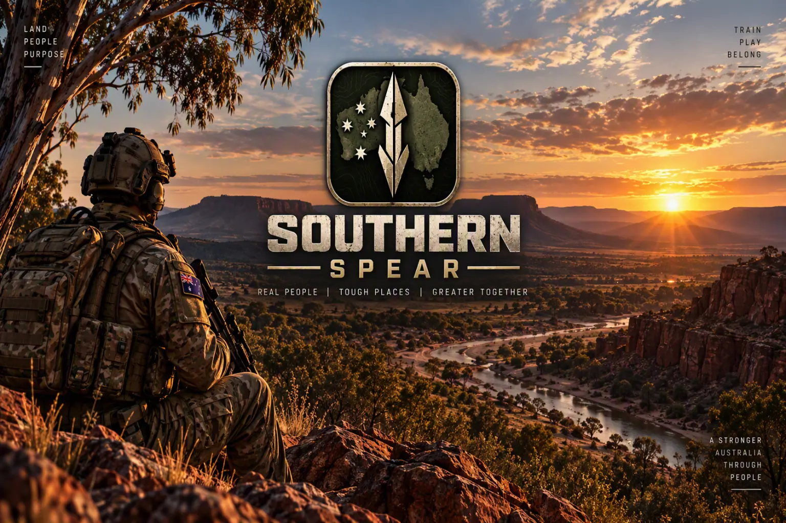
  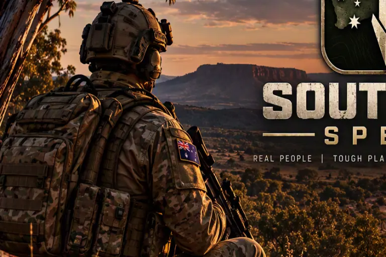
</p>

## Maps

Six maps are built and loadable. None is finished; the gap between "built" and "ready" is tracked per map
in [`Docs/ASSET_REGISTER.md`](Docs/ASSET_REGISTER.md).

| Map | Character | State |
|---|---|---|
| **Dry River** | Rural training area: a dry creek bed, scrub, farm structures and long sightlines | In the game: **the vertical-slice test bed** |
| **Red Gum Station** | A 1 km outback station: paddocks, gum-tree lines, fences, homestead | In the game, measured but not ready |
| **Selat Canal** | An urban canal district: walkable canal core, buildings, interiors | Built, in production |
| **Saltbush** | Open semi-arid range, built to test engagements beyond 200 m | Built, in production |
| **Bluestone** | A flooded slate pit converted from a studio diorama | Built, on the operations menu |
| **Ravenshoe Crossing** | A high-country gorge crossed by a 68 m wrought-iron lattice-girder road bridge | In production: 35/35 audit checks, navigation still unbaked |

## Roadmap

| Phase | Goal | State |
|---|---|---|
| **0. Audit & architecture** | Foundation decided, documents written, repository established | ✅ Complete |
| **1. Greybox vertical slice** | Multiplayer, teams, presentation, objectives, one map | 🟡 **Active**: both game modes running on Dry River |
| **2. Infantry combat** | Full weapon set, grenades, suppression, medical, movement | 🟡 Early work: per-weapon stats, penetration, hit zones, tactical movement, hand IK, cases and muzzle light |
| **3. Training & progression** | Training, qualifications, ranks, service record, barracks | 🟡 Early work: ranks, insignia and the service record |
| **4. Maps & layers** | Five maps, multiple layers, streaming, AI navigation | ⬜ Not started |
| **5. Online hardening** | Deployment, EOS, reconnection, admin, anti-cheat, load test | ⬜ Not started |
| **6. Content & polish** | Final art, audio, accessibility, performance, packaging | ⬜ Not started |

The full plan is in [`Docs/DEVELOPMENT_ROADMAP.md`](Docs/DEVELOPMENT_ROADMAP.md); weapons and animation in
[`Docs/WEAPONS_ANIMATION_PLAN.md`](Docs/WEAPONS_ANIMATION_PLAN.md).

## Architecture

Southern Spear's own code lives in plugins beside an **unmodified** Lyra. One bridge module is the only
place allowed to touch Lyra, and `Tools/validate_architecture.py` enforces the boundaries on every change.

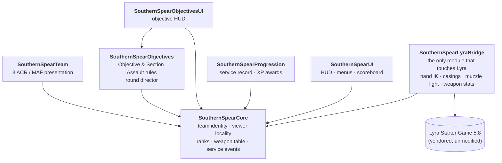

- **Presentation never touches gameplay** (ADR-004): damage, ammunition, movement and authority are
  server-side and untouched by anything cosmetic.
- **Faction presentation is viewer-relative** (ADR-017): the replicated truth is Team One / Team Two, and
  each client decides locally which side looks like 3 ACR. Resolution fails loudly and never defaults to a
  side.
- **Gameplay logic is C++; Blueprints configure.** Pure rules (objectives, ranks, casings, IK) are
  engine-light and unit-tested without a world.

## How it's made

- **69 recorded working sessions**, each recorded in [`Docs/CHANGELOG.md`](Docs/CHANGELOG.md): what was done, the
  exact test commands and results, new risks, defects found, and exactly one next action. Nothing is marked
  as passing unless it was run.
- **39 architecture decisions** in [`Docs/DECISION_LOG.md`](Docs/DECISION_LOG.md), from the module
  boundaries to the licensing position.
- **Around 80 C++ source files in seven plugins**, with an automated test suite. The last verified build
  passed 57 of 57 tests; newer tests are awaiting their first build.
- **Script-built content**: 31 Blender scripts and 92 Unreal Python scripts build the maps, weapons, gear
  and materials from specification, so a change is regenerated, not hand-edited.
- **Guards** run before every commit:
  - `validate_architecture.py` checks the module boundaries;
  - `check_unity_names.py` catches unity-build name clashes;
  - the map verifiers catch layout drift.

## Repository layout

| Path | Contents |
|---|---|
| `Plugins/SouthernSpearCore` | Team identity, viewer locality, ranks and insignia, weapon table, service events |
| `Plugins/SouthernSpearTeam` | Cosmetic 3 ACR / MAF presentation |
| `Plugins/SouthernSpearObjectives` | Objective Assault and Section Assault rules, objectives and the round director (+ `…ObjectivesUI`) |
| `Plugins/SouthernSpearProgression` | Service record, XP awards, persistence |
| `Plugins/SouthernSpearUI` | Player HUD, match menu, front end, scoreboard, loading screen |
| `Plugins/SouthernSpearLyraBridge` | Everything that touches Lyra: character, first person, weapons, hand IK, casings, muzzle light |
| `Plugins/GameFeatures/SSExp_*` | Game-mode experiences and their content |
| `Source/`, other `Plugins/` | Vendored Lyra 5.8, unmodified (see [`Docs/LYRA_ADOPTION.md`](Docs/LYRA_ADOPTION.md)) |
| `Tools/` | Blender and Unreal generators, guards and verifiers |
| `Site/` | Website source, published by `Tools/publish_site.py` |
| `Docs/` | Design, decisions, registers and evidence |

## Build and test

Engine at `E:\Unreal\UE_5.8`; commands run from the repository root.

```bat
python Tools\validate_architecture.py
python Tools\check_unity_names.py
E:\Unreal\UE_5.8\Engine\Build\BatchFiles\Build.bat SouthernSpearEditor Win64 Development -Project=%CD%\SouthernSpear.uproject -WaitMutex
E:\Unreal\UE_5.8\Engine\Binaries\Win64\UnrealEditor-Cmd.exe %CD%\SouthernSpear.uproject -nullrhi -unattended -nosplash -nosound -NoLoadingScreen -stdout -ExecCmds="Automation RunTests SouthernSpear;Quit" -TestExit="Automation Test Queue Empty"
python Tools\verify_dressing.py
```

Map generation, dressing and navigation are in the map documents
([`Docs/MAPS_DRYRIVER.md`](Docs/MAPS_DRYRIVER.md), [`Docs/MAPS_RAVENSHOE.md`](Docs/MAPS_RAVENSHOE.md)); the
playtest launch commands are in [`Docs/PLAYTEST_COMMANDS.md`](Docs/PLAYTEST_COMMANDS.md). Agents working in
the repository start with [`CLAUDE.md`](CLAUDE.md).

## Source control

This repository is **private**: it vendors Lyra and Epic content, which must not be republished. Binary
assets (`.uasset`, `.umap`, `.fbx`, `.blend`, `.png`, `.jpg`) are tracked with **Git LFS**. GitHub refuses a push
that references LFS objects it doesn't hold, so rebuilt assets are uploaded with `git lfs push` before the
commit is pushed; a fresh clone runs `git lfs pull` to fetch them. See [`CLAUDE.md`](CLAUDE.md) for the exact steps.
Third-party Fab packs and the raw ADF Re-Cut extraction are git-ignored and referenced in place (ADR-021).
The public website lives in [`theantipopau/southernspear-site`](https://github.com/theantipopau/southernspear-site).

## Credits

- **ADF Re-Cut** team: weapon, gear and animation source, used with the creators' permission (L-0021).
- **Epic Games**: Unreal Engine and the Lyra Starter Game, under the Unreal Engine EULA.
- **Fab** creators: environment, character, effects and audio packs, each recorded with its source and terms
  in [`Docs/LICENCE_REGISTER.md`](Docs/LICENCE_REGISTER.md).

## Disclaimer

Southern Spear is an original work of fiction and is free to play. It is **not endorsed, sponsored,
developed or approved** by the Australian Government, the Department of Defence, the Australian Defence
Force or the Australian Army. Its units and forces (3 ACR, the Murasian Armed Forces) and all characters and
events are fictional. Real equipment names and Australian Army ranks are used for authenticity only. It is
not affiliated with *America's Army*.
