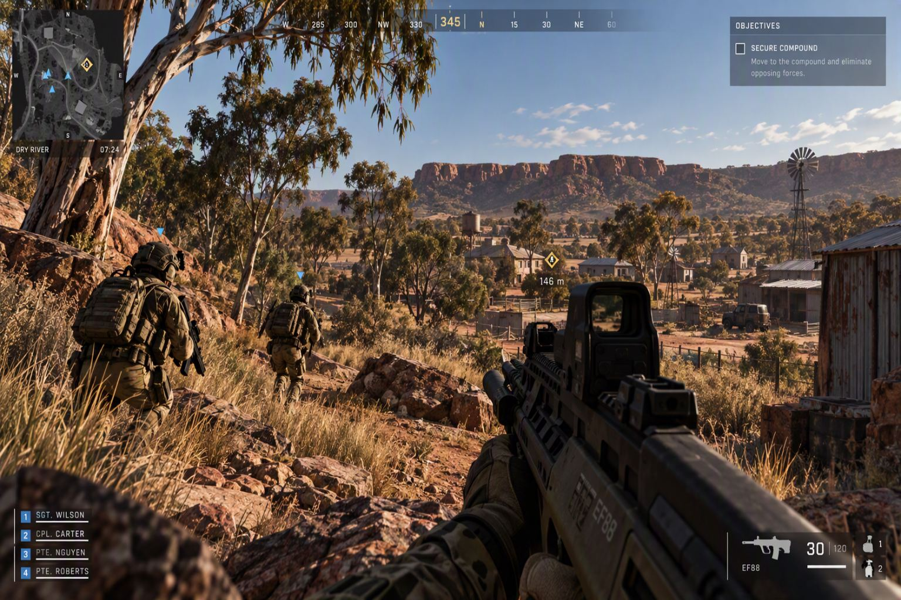
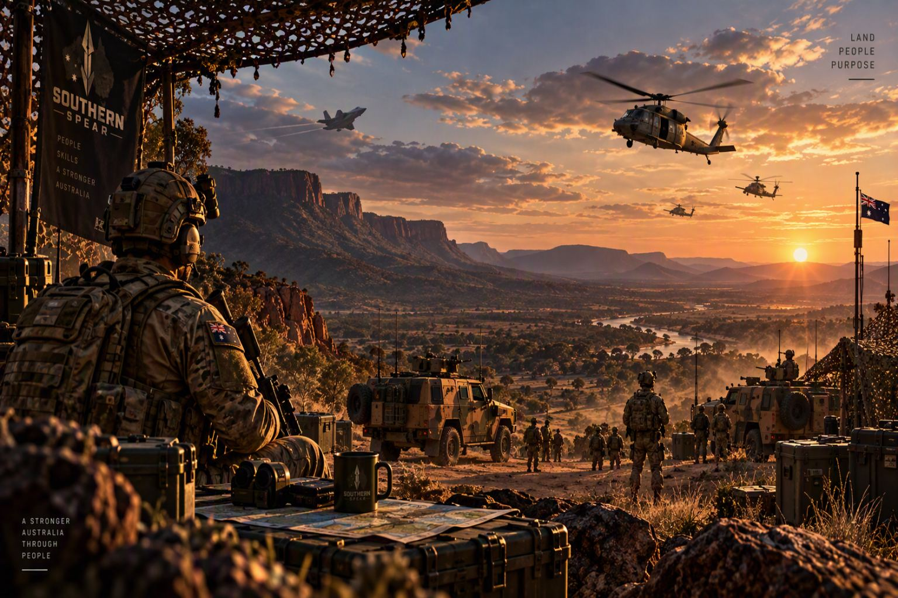
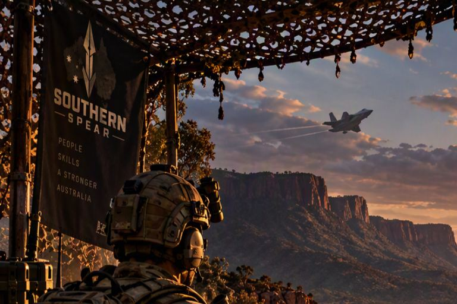

<p align="center"></p>

<h1 align="center">Southern Spear</h1>

<p align="center"><em>A free, community-developed Australian tactical multiplayer FPS.</em></p>

Southern Spear is a free, community-developed, Australian-inspired tactical multiplayer
first-person shooter built on **Unreal Engine 5.8.3** and the **Lyra Starter Game 5.8**.
Players serve in 3 ACR, a battalion of the fictional Commonwealth Land Service, against the
fictional Murasian Armed Forces (MAF). Both teams are mechanically identical. Each player sees
their own team as 3 ACR and the other team as MAF (ADR-017).

**Status: pre-alpha. Phase 1 (greybox vertical slice) is active.** There is no playable release.

| | |
|---|---|
| Website | https://theantipopau.github.io/southernspear-site/ |
| Rolling changelog | [`Docs/CHANGELOG.md`](Docs/CHANGELOG.md) — one entry per working session |
| Roadmap | [`Docs/DEVELOPMENT_ROADMAP.md`](Docs/DEVELOPMENT_ROADMAP.md) |
| Decisions | [`Docs/DECISION_LOG.md`](Docs/DECISION_LOG.md) — ADRs |
| Verified state and risks | [`Docs/PROJECT_AUDIT.md`](Docs/PROJECT_AUDIT.md) |
| Handover, Ravenshoe | [`Docs/HANDOVER_RAVENSHOE.md`](Docs/HANDOVER_RAVENSHOE.md) |

## Concept art

<p align="center">
  
  
</p>
<p align="center">
  
  
  
</p>

Full-resolution originals are in [`Docs/images/`](Docs/images/).

## Where we are

**Phase 0 (Audit & Architecture) is complete. Phase 1 (Greybox Vertical Slice) is active.**
Phases 2–6 have not started. The design deliberately spends Phases 1 and 2 on greyboxes proving
the systems — networking, team presentation, authority and persistence are expensive to get wrong
and cheap to get right early, and art is expensive in artist time and cheap in risk. Final art is
deferred to Phase 6.

| Phase | Goal | State |
|---|---|---|
| **0. Audit & Architecture** | Foundation decided, docs written, repo established | **Complete** — G0.8 passed; G0.9 blocked by engine distribution (R-09); G0.10 passed |
| **1. Greybox Vertical Slice** | Multiplayer, teams, presentation, one objective, one map, all placeholders | **Active** — G1.1, G1.2, G2.0, G2.1 passed; `SouthernSpearCore`, `SouthernSpearTeam` and `SouthernSpearObjectives` built and tested; Objective Assault running on Dry River |
| **2. Infantry Combat** | Full weapon set, grenades, suppression, medical, movement | Not started |
| **3. Training & Progression** | Training menu, qualifications, ranks, service record, barracks | Not started |
| **4. Maps & Layers** | Five maps, multiple layers, streaming, AI navigation | Not started |
| **5. Online Hardening** | Deployment, EOS, reconnection, admin, anti-cheat, load test, security review | Not started |
| **6. Content & Polish** | Final art, audio, accessibility, performance, packaging | Not started |

### Maps

Six maps are built and loadable. None is finished; all are placeholders, and the gap between
"built" and "ready" is tracked per map in [`Docs/ASSET_REGISTER.md`](Docs/ASSET_REGISTER.md).

| Map | Character | State |
|---|---|---|
| **Dry River** | Rural training area, dry creek bed, scrub, farm structures, long sightlines | Greybox, in the game — **the vertical-slice test bed** |
| **Red Gum Station** | 1 km outback station: paddocks, gum-tree lines, fences, homestead | In the game, **measured but not ready** |
| **Selat Canal** | Urban canal district: walkable canal core, buildings, interiors | Built, in production — the only Special Forces map |
| **Saltbush** | Open semi-arid range, built to test engagement ranges past 200 m | Built, in production |
| **Bluestone** | Flooded slate pit converted from a studio diorama | Built, on the operations menu |
| **Ravenshoe Crossing** | High-country gorge crossed by a 68 m wrought-iron lattice-girder road bridge; playable creek bed beneath | In production — **665 actors, 35/35 audit checks.** Navigation still unbaked |

Maps are generated from the specification in `Tools/`, not hand-placed. Geometry, layout and
metrics come from a shared spec module so the generator and the verifier cannot disagree, and the
verifier fails the build on drift. Ravenshoe's bridge, for example, is checked as ratios — span to
truss depth must sit inside 1:12–1:20, clear lane at least 6 m, headroom at least 4 m — because
every individual dimension can read correctly while the proportion is wrong.

### Notable open items

- **Navigation is not baked on Ravenshoe Crossing.** `BUILDPATHS` is a silent no-op without a real
  rendering device, so the bake has to be run by hand from the editor. Every other map's navigation
  state is tracked the same way.
- **The maps have been measured, not seen.** Values are read back from the saved `.umap` and
  asserted. Look-dev — fog, materials at play distance, silhouette readability — has not been done
  by eye on most of them.
- **Licensed third-party source is kept out of version control.** The ADF Re-Cut grant is personal
  and non-commercial, so the source files and everything derived from them stay local and only the
  documentation is tracked.

## Repository layout

| Path | Contents |
|---|---|
| `Plugins/SouthernSpearCore` | Team identity (`ESSTeamId`), viewer-relative locality, validation, tags, settings. No Lyra or SS dependencies |
| `Plugins/SouthernSpearTeam` | Cosmetic-only faction presentation and the stateless 3 ACR / MAF resolver |
| `Plugins/GameFeatures/SSExp_*` | Southern Spear game-mode experiences |
| `Source/`, other `Plugins/` | Vendored Lyra 5.8 (unmodified; see [`Docs/LYRA_ADOPTION.md`](Docs/LYRA_ADOPTION.md)) |
| `Content/Maps/` | The six playable maps plus the Lyra front end |
| `Tools/` | Blender and Unreal generators, the architecture guard and verifiers |
| `Art/` | Source art: characters, weapons, environment, brand |
| `Site/` | Website source, published by `Tools/publish_site.py` |
| `Docs/` | Design, decisions, registers, evidence (`Docs/evidence/`) and brand images (`Docs/images/`) |

## Build and test

Engine: `E:\Unreal\UE_5.8`. Commands are run from the repository root.

```bat
python Tools\validate_architecture.py
E:\Unreal\UE_5.8\Engine\Build\BatchFiles\Build.bat SouthernSpearEditor Win64 Development -Project=%CD%\SouthernSpear.uproject -WaitMutex
E:\Unreal\UE_5.8\Engine\Binaries\Win64\UnrealEditor-Cmd.exe %CD%\SouthernSpear.uproject -nullrhi -unattended -nosplash -nosound -NoLoadingScreen -stdout -ExecCmds="Automation RunTests SouthernSpear;Quit" -TestExit="Automation Test Queue Empty"
E:\Unreal\UE_5.8\Engine\Binaries\Win64\UnrealEditor-Cmd.exe %CD%\SouthernSpear.uproject -nullrhi -unattended -nosplash -nosound -NoLoadingScreen -stdout -ExecCmds="Automation RunTests SouthernSpear.Network.Gameplay.TwoPlayerAuthoritySmoke;Quit" -TestExit="Automation Test Queue Empty"
python Tools\verify_dressing.py
```

Per-map generation, dressing and navigation commands are in the map documents —
[`Docs/MAPS_DRYRIVER.md`](Docs/MAPS_DRYRIVER.md) §10, [`Docs/MAPS_RAVENSHOE.md`](Docs/MAPS_RAVENSHOE.md) §3.4.

## Working rules

- Every working session appends an entry to `Docs/CHANGELOG.md`: COMPLETED, FILES CHANGED,
  TESTING (command, exit code, result, evidence, NOT RUN items), ASSETS, RISKS, DEFECTS FOUND,
  and exactly one NEXT ACTION. Nothing is marked PASS unless it was executed.
- After the changelog is committed, publish the site: `python Tools/publish_site.py`.
- Presentation is cosmetic only (ADR-004). The architecture guard enforces the module boundaries.
- Check `Docs/ASSET_REGISTER.md` and `Docs/LICENCE_REGISTER.md` before importing any asset.
- Prefer reading a value back after writing it. Several UE 5.8 property writes fail silently, and a
  pass that reports success while writing nothing is the single most common defect this project has.

## Source control

This repository is **private**. It vendors Lyra and Epic content, which must not be republished.

Binary assets — Unreal `.uasset`/`.umap`, Blender `.blend`, `.fbx`, `.png`, `.jpg` and the rest —
are stored in **Git LFS** and *are* pushed to the private origin, so a fresh clone gets working
content rather than pointer files. Raw third-party Fab packs are deliberately **not** committed at
all: they are referenced in place, never modified, and the `.gitignore` excludes them (ADR-021). The
map therefore depends on those packs being installed locally; a clean clone is not expected to open
a map until they are.

The public website lives in a separate repository, `theantipopau/southernspear-site`, which
contains no game content.

## Disclaimer

Southern Spear is an original work of fiction. It is not endorsed, sponsored, developed or
approved by the Australian Government, the Department of Defence, the Australian Defence Force
or the Australian Army. All organisations, units, forces and weapons in it are fictional. It is
not affiliated with America's Army. Unreal Engine and Lyra are provided by Epic Games under the
Unreal Engine EULA.
